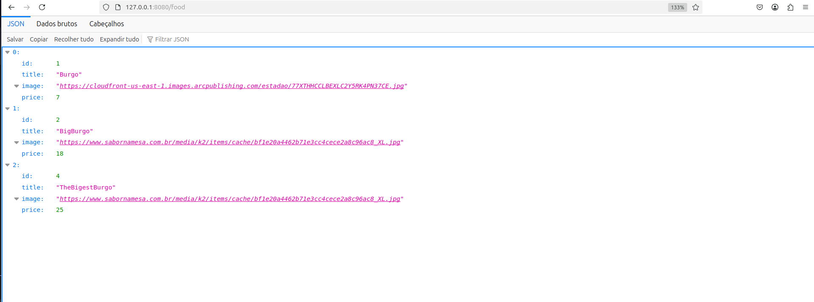

# Backend Cardapio CRUD 🍔

> Infos projetos

## Construção do projeto 🛠️

### Tecnologias 🔴

-   VsCode(Optional): O `Microsoft Visual Studio Code` é um editor de código gratuito, poderoso e leve para Windows, macOS e Linux. Baseado em código aberto, é altamente personalizável com mais de 25.000 extensões, para cada desenvolvedor e cada linguagem de programação.

-   Java: É uma plataforma de linguagem de programação e computação lançada pela primeira vez pela Sun Microsystems em 1995. Ele evoluiu de origens humildes para alimentar uma grande parte do mundo digital de hoje, fornecendo a plataforma confiável sobre a qual muitos serviços e aplicativos são construídos. Novos produtos inovadores e serviços digitais projetados para o futuro também continuam a depender do Java.

-   Spring: O `Spring Boot` facilita a criação de aplicativos autônomos baseados em Spring de nível de produção que você pode "apenas executar". Nós tomamos uma visão opinativa da plataforma Spring e de bibliotecas de terceiros para que você possa começar com o mínimo de barulho. A maioria dos aplicativos Spring Boot precisa de configuração mínima no spring.

-   PostgreSql: O `PostgreSQL` é um poderoso sistema de banco de dados objeto-relacional de código aberto que usa e estende a linguagem SQL combinada com muitos recursos que armazenam e dimensionam com segurança as cargas de trabalho de dados mais complicadas. As origens do PostgreSQL datam de 1986 como parte do projeto POSTGRES da Universidade da Califórnia em Berkeley e tem mais de 35 anos de desenvolvimento ativo na plataforma principal

### Instalação recomendações 🟡

### Rodar localmente 🟢

## Dockerfile e Docker-compose 🐋

## Comandos servidor Linux 🐧
