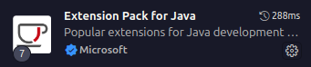
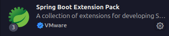

# Backend Cardapio CRUD 🍔


> Infos projetos

## Construção do projeto 🛠️

### Tecnologias 🔴

-   VsCode(Optional): O `Microsoft Visual Studio Code` é um editor de código gratuito, poderoso e leve para Windows, macOS e Linux. Baseado em código aberto, é altamente personalizável com mais de 25.000 extensões, para cada desenvolvedor e cada linguagem de programação.

-   Java: É uma plataforma de linguagem de programação e computação lançada pela primeira vez pela Sun Microsystems em 1995. Ele evoluiu de origens humildes para alimentar uma grande parte do mundo digital de hoje, fornecendo a plataforma confiável sobre a qual muitos serviços e aplicativos são construídos. Novos produtos inovadores e serviços digitais projetados para o futuro também continuam a depender do Java.

-   Spring: O `Spring Boot` facilita a criação de aplicativos autônomos baseados em Spring de nível de produção que você pode "apenas executar". Nós tomamos uma visão opinativa da plataforma Spring e de bibliotecas de terceiros para que você possa começar com o mínimo de barulho. A maioria dos aplicativos Spring Boot precisa de configuração mínima no spring.

-   PostgreSql: O `PostgreSQL` é um poderoso sistema de banco de dados objeto-relacional de código aberto que usa e estende a linguagem SQL combinada com muitos recursos que armazenam e dimensionam com segurança as cargas de trabalho de dados mais complicadas. As origens do PostgreSQL datam de 1986 como parte do projeto POSTGRES da Universidade da Califórnia em Berkeley e tem mais de 35 anos de desenvolvimento ativo na plataforma principal

### Instalação recomendações 🟡

### Instalação java ☕

#### Windows 🪟

Baixe o [Java Jdk](https://www.oracle.com/java/technologies/downloads/)
agora baixe a [Versão recente Java](https://www.java.com/pt-BR/download/)

#### Linux 🐧

Via terminal

```
sudo apt update
sudo apt upgrade

sudo apt install openjdk-21-jdk

# teste se instalou corretamente
java --version
```

#### MacOs 💻

Baixe o [Java](https://www.java.com/en/download/help/mac_install.html) e o [JDK](https://docs.oracle.com/en/java/javase/22/install/installation-jdk-macos.html)

### instalação IDE ⚙️

você pode utilizar qualquer IDE para o projeto minha preferencia e o [Visual Studio Code](https://code.visualstudio.com/) da Microsoft

Recomendado instalação extensões spring + java




### Instalação PostGreSql 🐘

Para testes você pode modificar a base do projeto e utilizar outros banco de dados como `h2` para testes locais. E necessario modificar o `aplication.properties` e o `pom.xml`

#### Windows 🪟

instalando o [PostgreSql](https://www.postgresql.org/download/) no Windows

```
psql

CREATE DATABASE food; # utilizando o padrão do projeto
CREATE USER name_of_user WITH PASSWORD 'password'; # Cria um usuario novo
GRANT ALL PRIVILEGES ON DATABASE food TO name_of_user; # Adciona todas as permissões

# Se você quiser pode modificar o user padrão "postgres"
ALTER USER postgres WITH PASSWORD 'password';

# quit
\q
```

#### Linux 🐧

```
sudo apt update
sudo apt upgrade -y

sudo apt install postgresql postgresql-contrib -y

# teste se o postgresql esta rodando
sudo systemctl status postgresql

# Configure seu usuario e seu banco de dados
sudo -i -u postgres
psql

-> dentro do psql
    CREATE DATABASE food;
    CREATE USER name_of_user WITH PASSWORD 'password'; # Cria um usuario novo
    GRANT ALL PRIVILEGES ON DATABASE food TO name_of_user; # Adciona todas as permissões

    # Se você quiser pode modificar o user padrão "postgres"
    ALTER USER postgres WITH PASSWORD 'password';

    # quit
    \q
```

#### MacOs 💻

instalando os pacotes MacOs [PostgreSql](https://www.postgresql.org/download/macosx/)

```
psql

CREATE DATABASE food; # utilizando o padrão do projeto
CREATE USER name_of_user WITH PASSWORD 'password'; # Cria um usuario novo
GRANT ALL PRIVILEGES ON DATABASE food TO name_of_user; # Adciona todas as permissões

# Se você quiser pode modificar o user padrão "postgres"
ALTER USER postgres WITH PASSWORD 'password';

# quit
\q
```

Você pode seguir o projeto normalmente se baixar o `postgresql` modificar apenas a senha do `postgres` user padrão e criando a database `food`.

## Rodar localmente Clonar o projeto 🟢

```
# Iniciando seu clone
git init
git remote add origin "Sua origin"
git branch -M main
git clone https://github.com/danielBRTanimacao/spring-cardapio-crud.git
git add .
git commit -a -m "se vc fez alguma modificação comite e suba para seu repositorio"
git push -u origin main

```

```
mvn clean install # instala as dependencias do pom.xml
mvn run ./appname
```

## Dockerfile e Docker-compose 🐋

## Comandos servidor Linux 🐧
